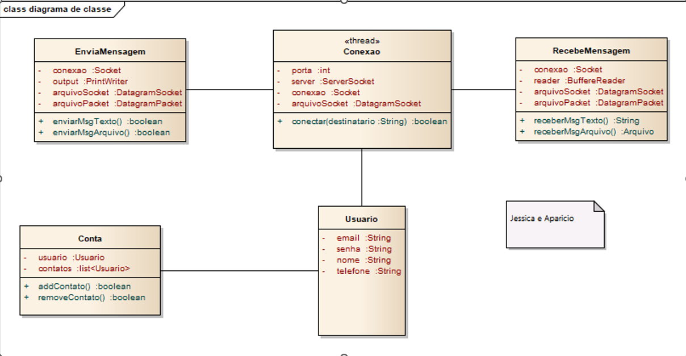
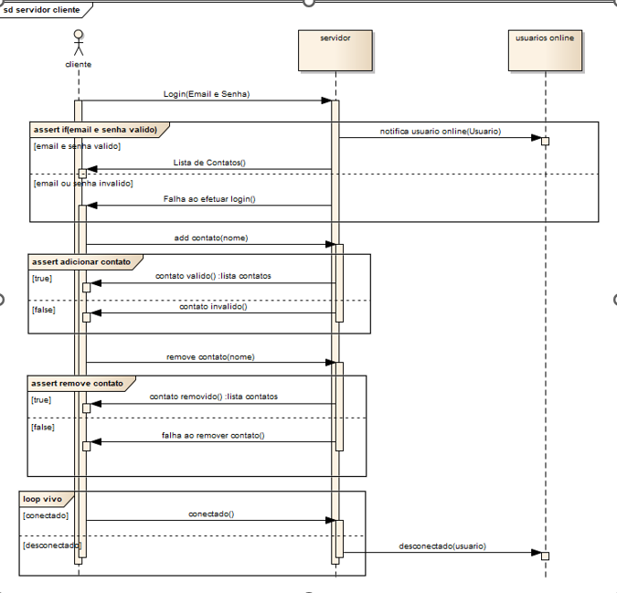
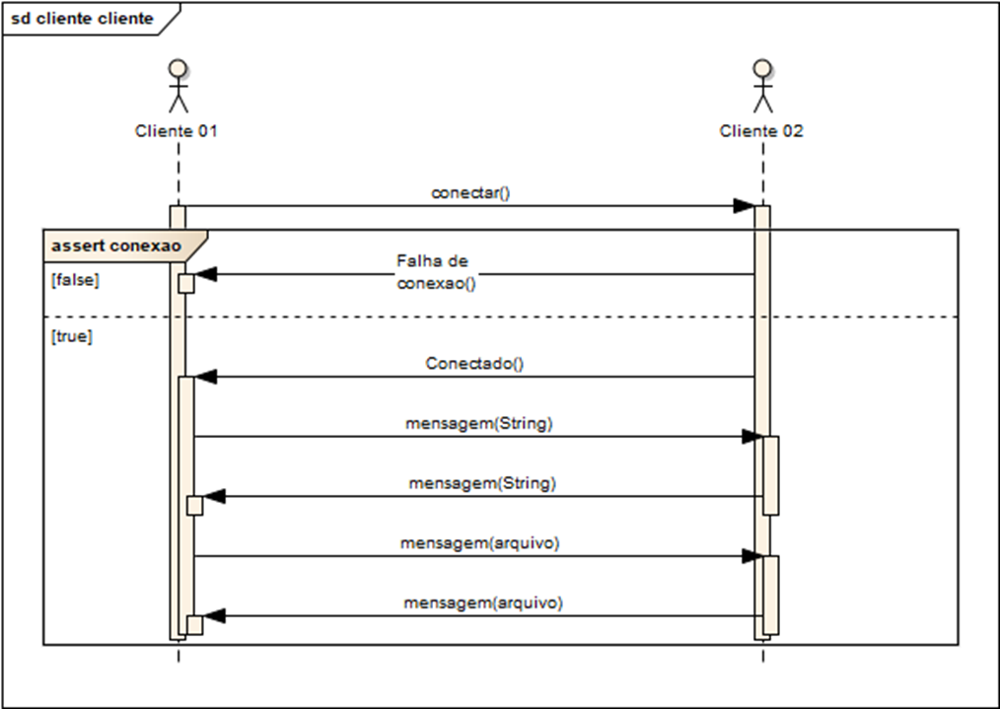

# snakke

**Trabalho da faculdade (semestre 2019.1).**
-------------

Utilizando sistemas concorrentes e distribuídos foi criado uma implementação de um **Sistema de Chat**, em que os usuários gerenciam seus contatos e trocam mensagem.

###### Requisitos Funcionais
- O Sistema deve autenticar o usupario para entrar no sistema de chat (no servidor)
-O sistema deve permitir que o usuário altere seus dados cadastrais (nome, telefone, etc)
- O sistema deve mostrar ao usuário uma lista com seus contatos, com distinção entre aqueles
que estão online e offline.
- O sistema deve permitir que o usuário gerencie seus contatos (adicionar ou excluir)
- O sistema deve permitir que o usuário inicie um chat com um contato online. O chat deve permitir troca de mensagens texto e envio de arquivo. O envio/recebimento de arquivo não pode bloquear o envio/recebimento de mensagens de texto.
- O sistema deve permitir que o usuário inicie vários chats simultaneamente.
- O sistema deve manter atualizada a lista de contatos online e offline.
- O sistema deve permitir que o usuário faça uma chamada com áudio.

###### Requisitos não funcionais
- O sistema deve ser distribuído.
- A aplicação servidor armazena os usuários cadastrados, seus contatos, e autentica usuários.
- A aplicação cliente (chat) carrega os contatos.
- A comunicação cliente/servidor só é permitida para:
	- Autenticar o usuário e carregar a lista de contatos.
	- Manter o usuário online.
- Para o chat entre usuários, deve ser utilizada comunicação cliente/cliente.
- A aplicação cliente deve ter interface gráfica.

Diagrama de classe:

Diagrama de sequência

Design Patterns utilizados:
- Observer : em todas telas
- Singleton : Conta, Servidor e ControllerApp